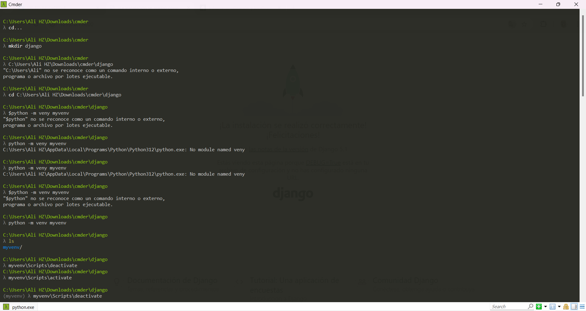
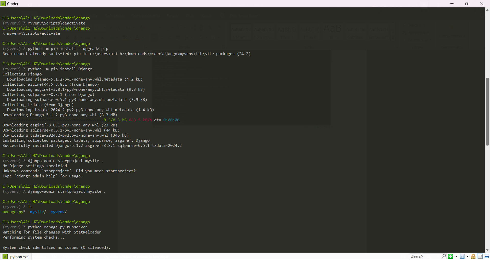
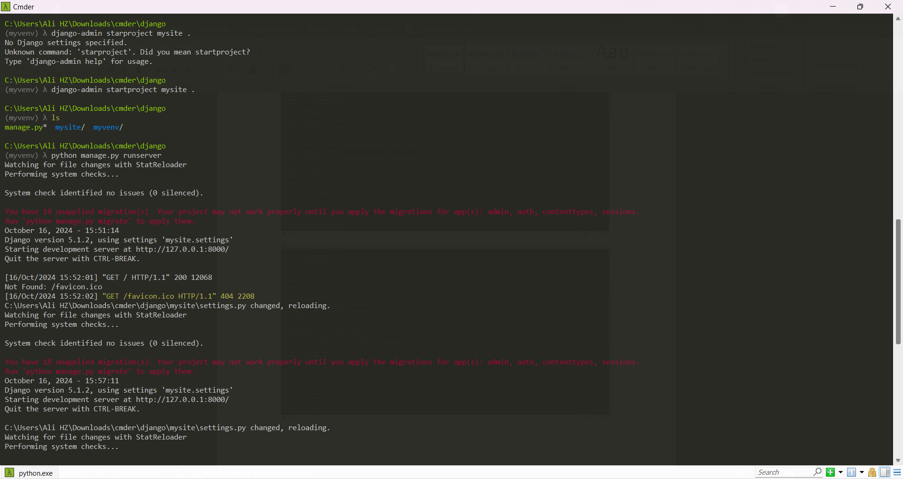
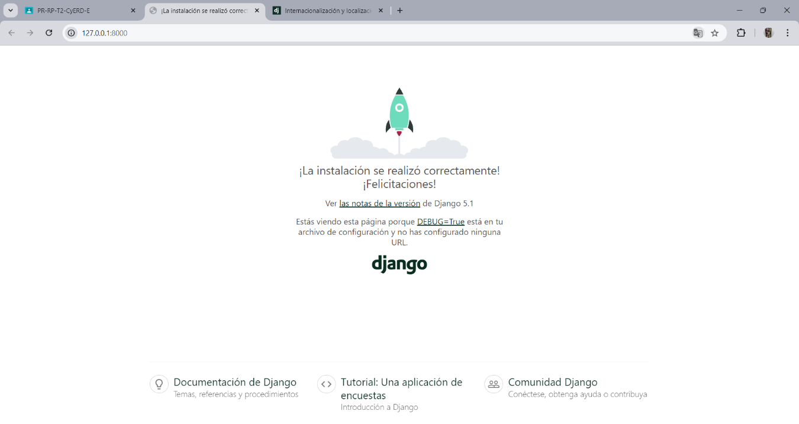
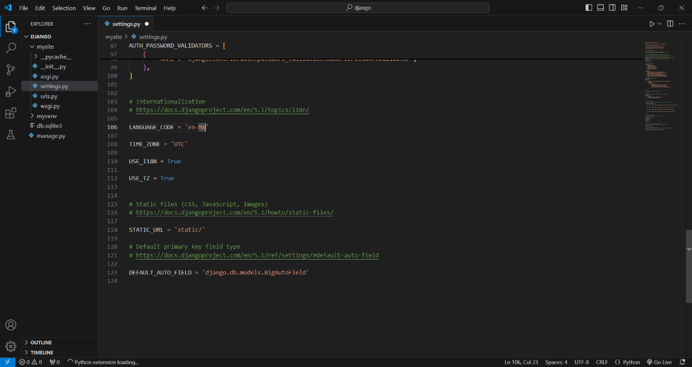
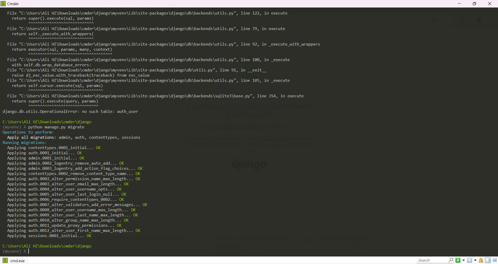
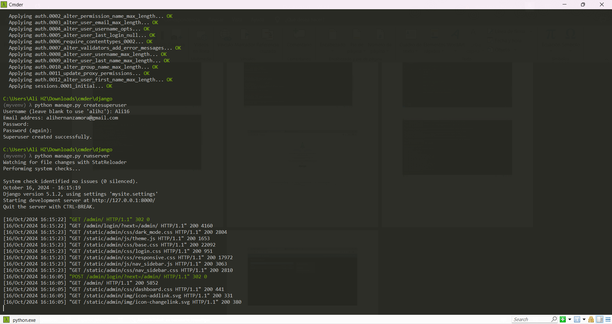
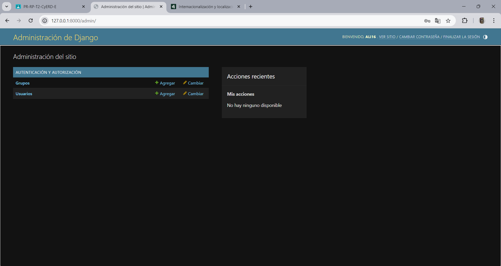
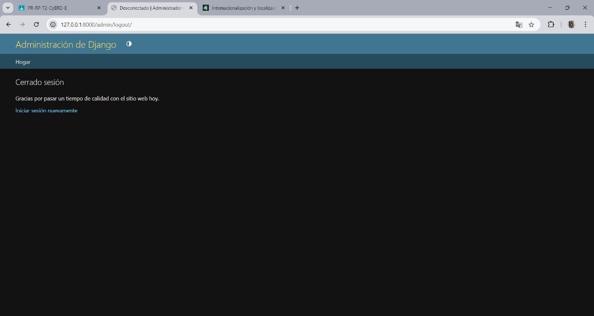

**INSTITUTO TECNOLOGICO SUPERIOR DE CHICONTEPEC**
“POR UNA EXELENCIA EDUCATIVA”

**INGENIERIA EN SISTEMAS COMPUTACIONALES**

**MATERIA:**
TOPICOS SELECTOS DE PROGRAMACIÓN WEB
**TEMA:**
MANUAL DE INSTALCIÓN Y CONFIGURACIÓN DE DJANGO

GRUPO: **ISC-7E**

**ALUMNO:**
		ALITZEL HERNANDEZ ZAMORA
 **DOCENTE:**
		ING.  SAID JAIR GUERRA ESCUDERO

Se crea una carpeta en a parte de cd llamada mkdir en accedes como django, una vez echo esto se ponen los comandos a seguir para que este programa sea ejecutado de manera correcta, los comandos a utilizar son los que podemos observar

Una vez echo lo anterior se desactiva y activa concordando junto con los comandos, se de la parte de instalar ya sea los requerimientos y a su vez Django, se ejecutan de la misma comandos para que este nos identifique de manera correcta

De a misma manera se siguen aplicando los comandos a utilizar para que este sea funcionable, cada comando cumple con una funcion distinta dentro de la cual nos ayudara llegar a lo que queremos

Una vez identificada y con el server que tenemos o en su defecto que nos aparece, nos vamos al navegador y podremos ver que nos dará la pagina que estaremos ocupando para las distintas practicas.

Una vez echo lo anterior nos vamos al código en visual studio para cambiar el idioma y este sea en Español

Seguimos aplicando los comandos para lo cual en esta ocasión debemos crear un usuario y contraseña que nosotros recordemos de manera correcta y los comandos para que este se diga actualizando.

Una vez creado el Usuario y contraseña, nos volvemos a ir a la pagina ya vista, solo que esta vez agregando a la ruta ADMIN, el cual nos pedirá nuestro usuario y contraseña, para lo cual debe ser la que creamos anteriormente, dándole clic en entrar, nos mostrara esta interfaz y podemos cerrar sesión para que no haya perdida de información

